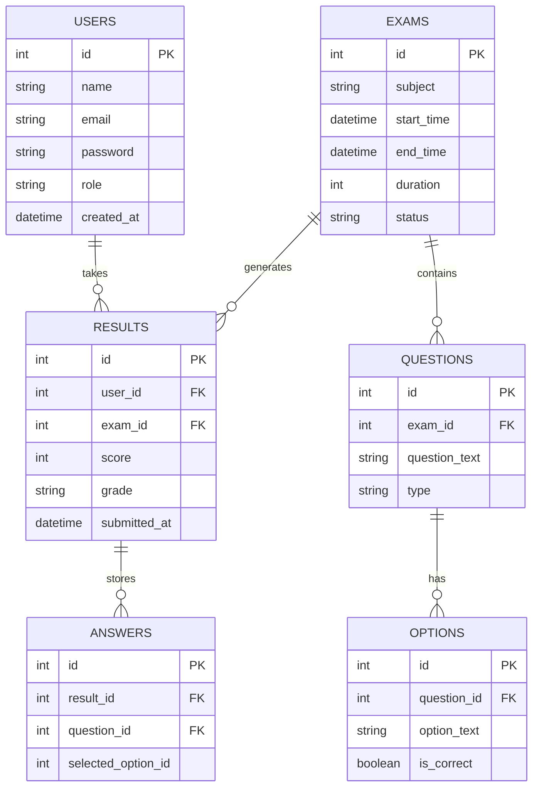
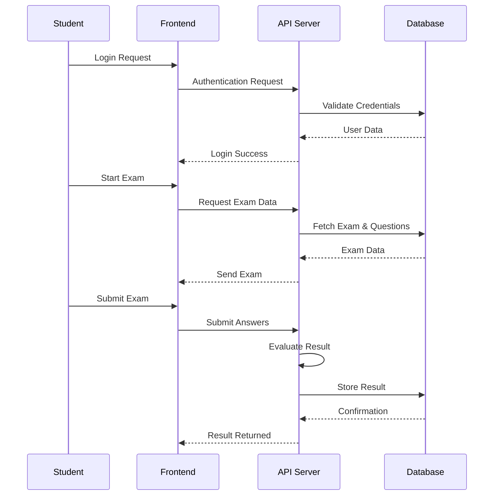

Perfect. Below is your **complete, final, professional README.md** — clean, well-structured, industry-standard, and **based on your ER + Architecture design**, without unnecessary code clutter.

You can **copy-paste this directly** into your GitHub `README.md`.

---

# 📚 EduQuiz — Modern Online Examination System


**EduQuiz** is a modern, full-stack online examination platform designed to support secure, structured, and efficient digital assessments. The system provides a controlled administrative environment alongside a focused student examination interface, ensuring reliability throughout the entire examination lifecycle.

EduQuiz is built with simplicity, scalability, and clarity in mind—making it suitable for academic institutions, training centers, and evaluation-based platforms.

---

## 🚀 Overview

EduQuiz manages the complete online examination workflow:

**Exam Creation → Scheduling → Live Examination → Evaluation → Performance Analysis**

The platform operates through two clearly separated environments:

* **Administrative Control Center** — Exam setup, scheduling, result monitoring, and score management
* **Student Examination Portal** — Exam participation, live progress tracking, and result review

---

## ✨ Key Features

### 🛡️ Administrative Control Center

* Centralized creation and management of exams
* Subject-based organization of assessments
* Precise scheduling with start time, end time, and duration enforcement
* Real-time performance monitoring and grading distribution
* Manual score correction and student result management

---

### 🎓 Student Examination Portal

* Clean, distraction-free examination interface
* Live countdown timer and progress indicator
* Automatic submission upon exam timeout
* Instant result generation with grade classification
* Practice mode for reviewing completed or expired exams

---

## 🛠️ Technology Stack

* **Frontend:** HTML5, CSS3, Vanilla JavaScript (ES6+)
* **Backend:** Node.js with Express.js (RESTful architecture)
* **Database:** MySQL (relational data management)

The system follows a REST-based communication model for efficient client–server interaction.

---

## 🧩 System Architecture

EduQuiz is designed using a layered architecture to maintain separation of concerns and system clarity.

### Architecture Overview

```mermaid
flowchart LR
    A[Client Browser] --> B[Frontend Layer]

    subgraph Frontend
        B1[Login Interface]
        B2[Admin Dashboard]
        B3[Student Dashboard]
        B4[Exam Interface]
    end

    B --> C[REST API Layer<br>(Express.js)]

    subgraph Backend
        C1[Authentication Controller]
        C2[Exam Controller]
        C3[Result Controller]
        C4[Admin Controller]
    end

    C --> C1
    C --> C2
    C --> C3
    C --> C4

    subgraph Business Logic
        D1[Auth Logic]
        D2[Exam Engine<br>(Timer & Auto-Submit)]
        D3[Evaluation Engine]
        D4[Analytics Engine]
    end

    C1 --> D1
    C2 --> D2
    C3 --> D3
    C4 --> D4

    subgraph Data Layer
        E[(MySQL Database)]
    end

    D1 --> E
    D2 --> E
    D3 --> E
    D4 --> E
```

---

## 🗄️ Database Design (ER Diagram)

The database follows a normalized relational structure to support scalability and accurate evaluation.



---

## 🔄 Examination Flow (Sequence Diagram)

This diagram illustrates how a student interacts with the system during an exam.



---

## 🔐 Security Considerations

* Role-based access control (Admin vs Student)
* Admin-level verification using secure PIN
* Parameterized database queries to prevent SQL injection
* Clear separation of API responsibilities

---

## 👨‍💻 Development Team

**Sajidur Rahaman**
Backend Development, API Design, Database Architecture

**Minhaj Chowdhury**
Frontend Development, UI/UX Design, Exam Engine Logic

---

## 🤝 Contribution

Contributions are welcome and appreciated.

* Follow a structured development workflow
* Keep changes focused and well-documented
* Submit pull requests for review

---

## 📜 License

This project is distributed under the **MIT License**.
See the `LICENSE` file for more information.

---

## 📌 Final Note

EduQuiz is built with a clear objective:

**to deliver a reliable, structured, and scalable system for conducting online examinations with clarity and control.**


